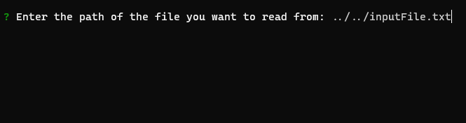
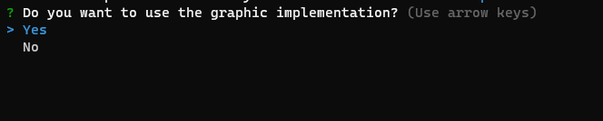
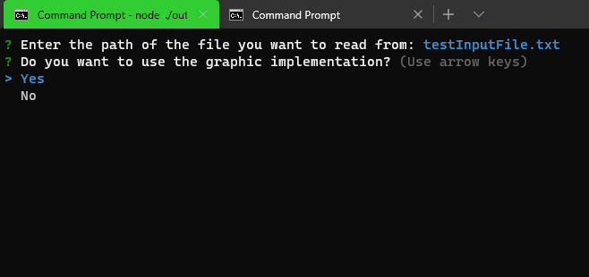

# Diagnostic Evaluation

A CLI based program which evaluates a string taken from an external file and tells if it is a **palindrome** or not by using a generic type stack data structure.

## Table of Contents

- [Requirements](#📃-requirements)
- [Installation](#⚙-installation)
- [How it works](#🕹-how-it-works)
- [How to use](#🚀-how-to-use)

## 📃 Requirements

- [Node JS.](https://nodejs.org/en/)

## ⚙ Installation

With **Node JS** being previously installed in your computer run the following command in your terminal at the root of this project (where the **package.json** file is):

```
npm install
```

**📝 Note:** Consider that sometimes the previous command throws an error so may need to run it again until all the dependencies are installed correctly.

<hr>

After the previous command run the following:

```
npm start
```

This last one will execute the CLI program.

## 🎢 How it works

The program takes the input data from an external plain text file, so in order to work in a more friendly way the text extracted from the file is then modified by removing some punctuation marks and spaces.

After that the text that remains is pushed into a stack twice, in the first stack the data is pushed in its natural order and in the second one the data is pushed backwards.

Then the program compares each character from one stack with its corresponding of the second one, whenever all the comparations are thruty the text is cosidered a palindrome, otherwise it is not.

## 🚀 How to use

### Happy path 😊🛣

When the program is executed it will ask you a couple of questions on how you want to run it, by default you can just **press enter** on each of them and it will work just fine.

### Specifying the input file

The first question the program shows asks to enter the path of the file where it will take data from, here you can provide either a relative or an absolute path.



📝**Note:** the source should be a **plain text** file, therefore, if you provide a bad source the program may return an error.

### Select whether to use the graphic implementation or not

A self explanatory question, this will decide whether to show the cool graphical CLI output or the boring and simple result of the evaluation. You decide. 😉



Enjoy!!! 🎉




